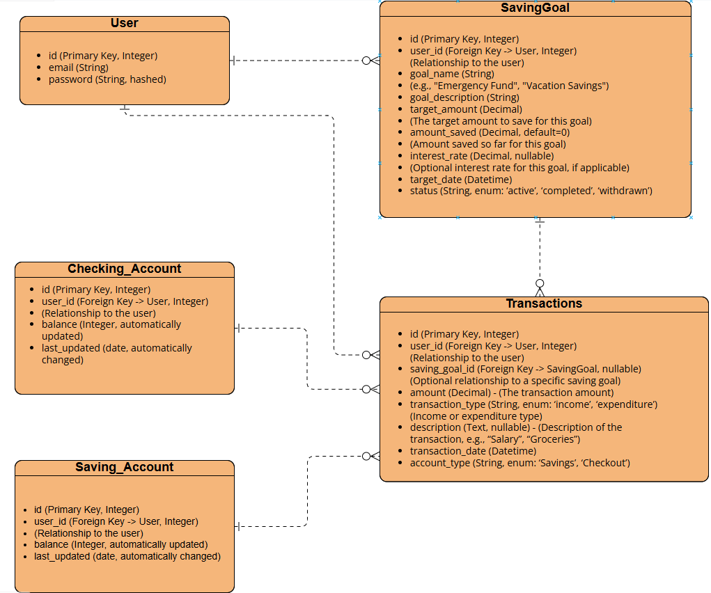

## 🗣️ Introduction to SaveWise

SaveWise is a Django web application that allows its users to manage their savings, track their spendings and income and understand where their money goes.

Users will be able to add their financial goals, transactions, and choose where their money goes by deciding if the transaction is an income or expenditure, and whether it gets transferred to their savings account or checking (daily use) account. The homepage shows analytics of the user's money patterns.

This project reflects real-life application in terms of basic financial management that everyone can benefit from.

---

## ⚙️ Key Features

**1. User Authentication 🔑:**

- User registration (sign up) and login.
- User profile management (email, password change).
- Password encryption and security.
- Forgot password and password recovery functionality.

**2. Savings Goal Management 🥅:**

- Add an image of the goal (optional).
- Users can create multiple saving goals (e.g., "Trip to Maldives", "Emergency Fund").
- Set a target amount for each saving goal.
- Track the amount saved towards each goal.
- Define an interest rate for savings goals (optional).
- Set a target completion date for each saving goal.
- Mark goals as active, completed, or withdrawn.

**3. Transaction Tracking 💵:**

- Users can record income and expenditure transactions.
- Track transaction amount, type (income or expenditure), and description (e.g., “Salary” or “Groceries”).
- Link transactions to specific saving goals (optional).
- Track the date and time of each transaction.

**4. Goal Progress Monitoring 🖲️:**

- Users can monitor their savings progress in real-time.
- Track how much has been saved towards each goal.
- Display percentage progress for each goal (e.g., 75% of the target amount saved).

**5. Analytics Summary & Reporting 📈:**

- Display transaction summaries (daily, weekly, monthly).
- Show total income and expenditure for the user.
- Whenever a transaction is created (either income or expenditure), the value_saved for the corresponding saving goal should be updated automatically.
- If the transaction is an income type, the value_saved should increase by the transaction amount.
- If the transaction is an expenditure type, the value_saved should decrease by the transaction amount.

**6.Security & Data Integrity 🔐:**

- Ensure user data (goals, transactions) is securely stored.
- Regular backups to avoid data loss.
- Proper authentication and authorization for data access.

**7. User Experience Enhancements 👤:**

- A user-friendly dashboard showing all goals and progress at a glance.
- Mobile responsiveness (so the app is usable on any device).
- Interactive forms for adding transactions and setting goals.

## 🛠️ Technologies Used

| **Component**         | **Technology**                                                                 |
|-----------------------|---------------------------------------------------------------------------------|
| **Backend**           | Python 3.11+   Django 5.x (Models, Views, Templates, Authentication)         |
| **Frontend**          | HTML5 & CSS3 (with modular CSS in /static/css/)   Django Templates          |
| **Database**          | SQLite   PostgreSQL                                                            |
| **Version Control**   | Git + GitHub                                                                   |
| **Deployment (optional)** | Renderer                                                                      |

 

## 🗄️ Modelling and Entity Relationship Diagram

### Models

**1. User Model (for Authentication)**

Fields for managing user accounts:

- id (Primary Key, Integer)
- email (String)
- password (String, hashed)

 

**2. Goal Model**

This model tracks the user’s goals and their progress:

- id (Primary Key, Integer)
- user_id (Foreign Key -> User, Integer)
(Relationship to the user)
- goal_name (String)
(e.g., "Emergency Fund", "Vacation Savings")
- goal_description (String)
- target_amount (Decimal)
(The target amount to save for this goal)
- amount_saved (Decimal, default=0)
(Amount saved so far for this goal)
- interest_rate (Decimal, nullable)
(Optional interest rate for this goal, if applicable)
- target_date (Datetime)
(The deadline by which the goal should be completed)
- status (String, enum: ‘active’, ‘completed’, ‘withdrawn’)
(Status of the goal: whether it's active, completed, or withdrawn)

 

**3. Transaction Model**

This model tracks every financial transaction (either income or expenditure):

- id (Primary Key, Integer)
- user_id (Foreign Key -> User, Integer)
(Relationship to the user)
- saving_goal_id (Foreign Key -> SavingGoal, nullable)
(Optional relationship to a specific saving goal)
- amount (Decimal)
(The transaction amount)
- transaction_type (String, enum: ‘income’, ‘expenditure’)
(Income or expenditure type)
- description (Text, nullable)
(Description of the transaction, e.g., “Salary”, “Groceries”)
- transaction_date (Datetime)
(The date the transaction occurred)
- account_type (String, enum: ‘Savings’, ‘Checkout’)
- status (String, enum: ‘completed’, ‘pending’)
(Status of the transaction, for tracking payments or scheduled deposits)

 

**4. Accounts model**

This model tracks every financial transaction (either income or expenditure):

- id (Primary Key, Integer)
- user_id (Foreign Key -> User, Integer)
(Relationship to the user)
- name (String, enum: ‘Savings’, ‘Checking’)
- balance (Integer, automatically updated)
- last_updated (date, automatically changed)

 

### Entity Relationship Diagram 🔷

 

## Project Structure 📂:

(Will add it later too)